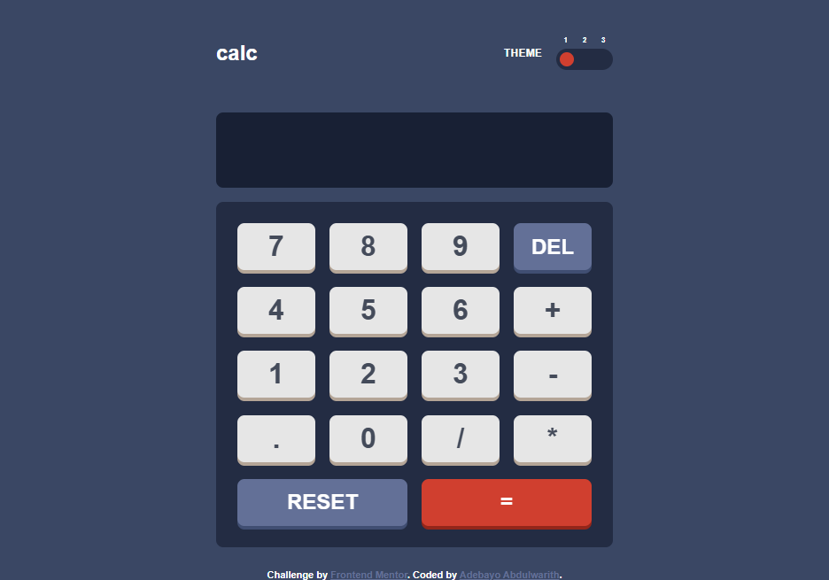
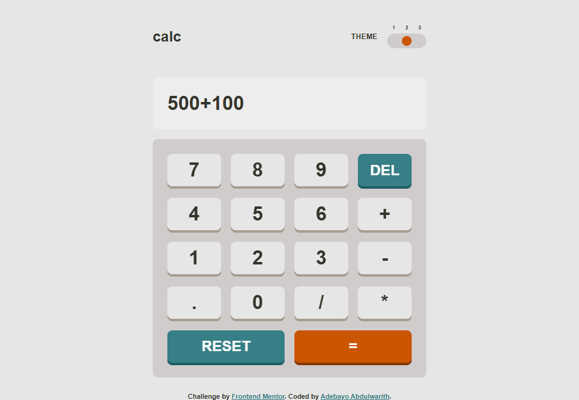
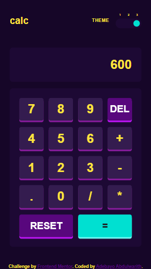

# Frontend Mentor - Calculator app solution

This is a solution to the [Calculator app challenge on Frontend Mentor](https://www.frontendmentor.io/challenges/calculator-app-9lteq5N29). Frontend Mentor challenges help you improve your coding skills by building realistic projects.

## Table of contents

- [Overview](#overview)
  - [The challenge](#the-challenge)
  - [Screenshot](#screenshot)
  - [Links](#links)
- [My process](#my-process)
  - [Built with](#built-with)
  - [Continued development](#continued-development)
  - [Useful resources](#useful-resources)
- [Author](#author)

## Overview

### The challenge

Users should be able to:

- See the size of the elements adjust based on their device's screen size
- Perform mathmatical operations like addition, subtraction, multiplication, and division
- Adjust the color theme based on their preference
- **Bonus**: Have their initial theme preference checked using `prefers-color-scheme` and have any additional changes saved in the browser

### Screenshot





### Links

- Solution URL: [Add solution URL here](https://your-solution-url.com)
- Live Site URL: [Add live site URL here](https://your-live-site-url.com)

## My process

### Built with

- Semantic HTML5 markup
- CSS custom properties
- Flexbox
- CSS Grid
- Mobile-first workflow
- [React](https://reactjs.org/) - JS library

### What I learned

```js
<h1>So Js code I'm proud of</h1>;
eval("a + b");
```

This particular built in method is what made my Calculator's calculations possible in the first place, this my first encounter with it though and i'll say it's really cool and helpful.

### Continued development

I'll continue learning everyday to sharpen my skills...

### Useful resources

- [Example resource 1](https://www.chatGPT.com) - This helped me with the theme, when i'm confused about how to make the themes work with both system and manual settings...

## Author

- Frontend Mentor - [@BIGWHALE-dev](https://www.frontendmentor.io/profile/BIGWHALE-dev)
- Twitter - [@adebayowarith86](https://www.x.com/adebayowarith86)
